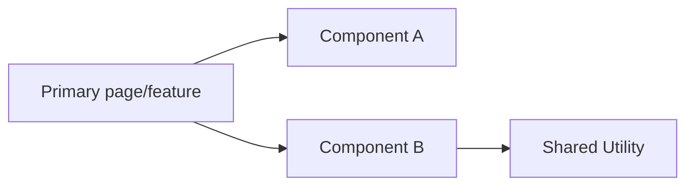
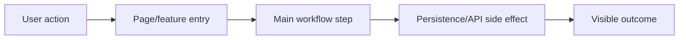

## Brief
- Original request: <source request from Jira ticket or SPEC bundle>

## Changes
- <implementation change 1>
- <implementation change 2>

## Component Dependencies Diagram

## Workflow Diagram

## Test Report
- Coverage (high level): <known coverage summary or "Not available in this run">.
- Tests passed count: <known count or "Not available in this run">.

## Risks and Follow-ups
- <risk, limitation, or follow-up item>
